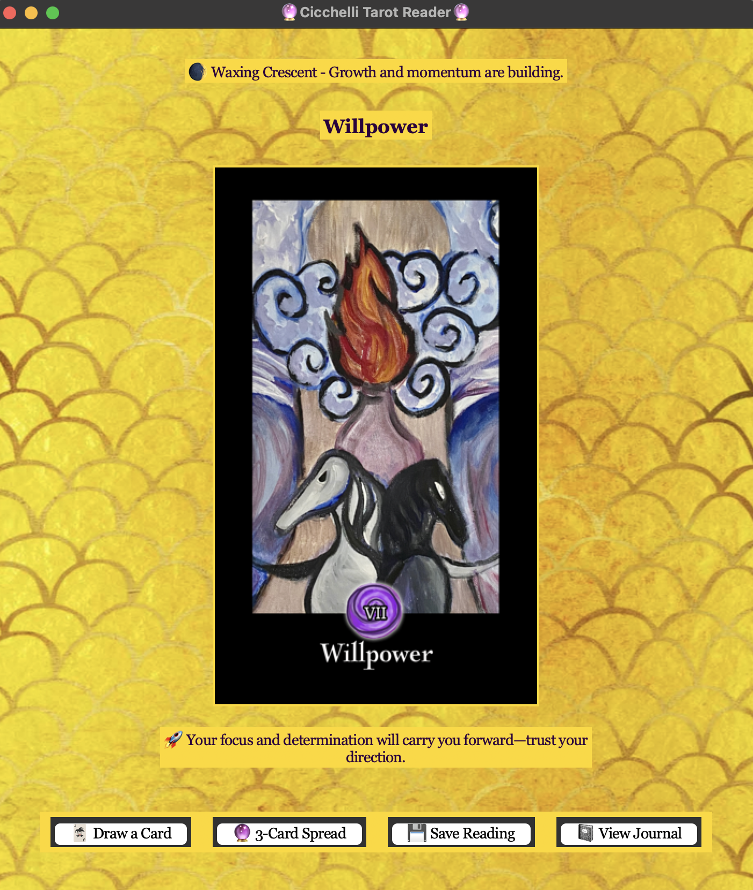

# Tarot GUI Application 🔮

An intuitive desktop tarot reading application built with Python.  
Designed to blend traditional divination with a modern, artistic user experience.

## 🛠 Technologies Used
- Python 3
- Tkinter (GUI Library)
- PIL/Pillow (Image Handling)
- Ephem (Moon Phase Syncing)

## 🎴 Features
- Single-card and three-card tarot spreads
- Moon phase integration
- Customized GUI layout and aesthetic
- Saving readings to a personal journal

## 🌱 Future Improvements
- Additional spread layouts
- Enhanced user customization
- Saving and exporting journal entries

---

**Built with curiosity, creativity, and a little bit of magic.**

